# Number Baseball

숫자 야구는 숫자를 가지고 진행되는 간단한 게임입니다.
사용자가 임의의 숫자를 입력하면 랜덤으로 생성된 정답 숫자와 자릿수와 값을 비교합니다.
자릿수와 값이 모두 같다면 Strike, 값은 같지만 자릿수가 다르다면 Ball, 양쪽 다 아니라면 Nothing으로 표시합니다.

## Requisite, Optional

---

### Requisite

Requisite 패키지는 과제의 필수 조건만을 구현했습니다.

Requisite 패키지는 실행 시켰을 때 바로 게임이 시작됩니다.
게임이 시작되면 정답에 대한 제한 조건이 표시됩니다.

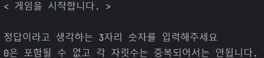

사용자가 입력한 숫자가 제한 조건을 어기지 않았다면 해당 숫자에 맞는 힌트를 줍니다.

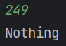

볼이나 스트라이크가 없다면 Nothing이라고 표시해줍니다.

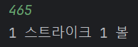

만약 조건을 어겼다면 어떤 조건을 어겼는지 알려줍니다.
여러 조건을 어겼어도 우선 순위에 따라 그 중 하나의 조건만을 알려줍니다.

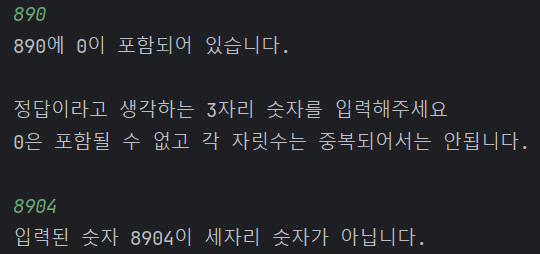

입력된 숫자와 정답이 같을 경우 정답임을 표시해줍니다.

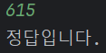

---

### Optional

optional 패키지는 과제의 선택 기능을 모두 구현했습니다.

optional 패키지는 프로그램이 실행되면 메뉴를 입력받습니다.

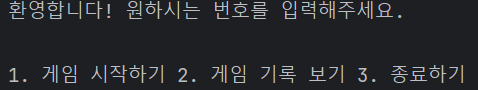

메뉴에 해당하지 않는 숫자를 입력하면 잘못된 입력임을 알려주고 다시 메뉴를 입력받습니다.

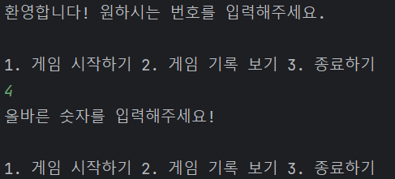

1을 입력하면 게임이 시작되고 숫자에 대한 제한 조건이 표시됩니다.
조건이 달라진 것을 제외하면 Requisite과 동일하게 게임이 진행됩니다.

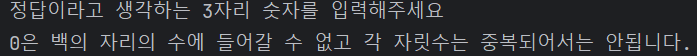

정답을 맞추면 다시 메뉴를 선택합니다.

2를 입력하면 프로그램이 실행된 이후 진행된 게임에 대한 기록을 보여줍니다.
이 때 시도 횟수는 잘못된 입력은 포함하지 않습니다.
기록이 표시된 후 다시 메뉴를 선택합니다.

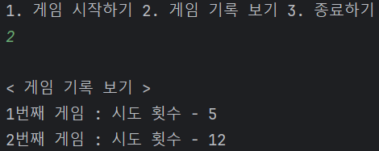

이전에 게임을 진행한 기록이 없다면 기록된 게임이 없다는 메시지를 표시합니다.

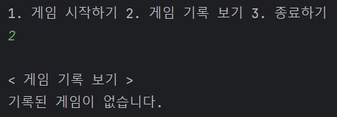

3을 입력하면 프로그램이 종료됩니다.

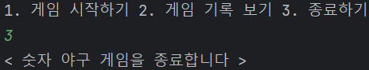

## Velog

[Velog Link](https://velog.io/@wl763/Kotlin-%EC%B1%85%EC%9E%84-%EC%97%B0%EC%87%84-%ED%8C%A8%ED%84%B4%EC%9D%84-%EC%9D%B4%EC%9A%A9%ED%95%9C-Validation-%EA%B5%AC%ED%98%84)

